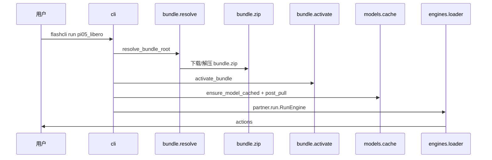

# 架构说明

flashcli 是 FlashRT 的**分发与运行宿主**：解析 preset、获取 Model Bundle、安装依赖、缓存权重，并调用 bundle 内 **`partner.*`** 的 `RunEngine` / `ServeEngine`。

**不负责**具体模型 forward、CUDA kernel；这些在 bundle 的 `runtime/python/partner/`（及可选 `flash_rt/`）中实现。

## 核心原则

1. **推理在 bundle 内** — `flashcli-bundle.json` 的 `entry` 指向 `partner` 模块；flashcli 只做 `importlib` 加载。
2. **catalog 极简** — `models.yaml` 仅含 preset 名与 bundle 源（`zip` / `path` / `git`）。
3. **一条命令** — `flashcli run <preset>` 串联：依赖 → bundle → 权重 → `post_pull` → 推理。
4. **可选 HTTP** — `flashcli serve` 由 bundle 实现 `ServeEngine`；当前发布的 `pi05_libero` 仅 `run`。

## 与 FlashRT 的边界

| 职责 | flashcli | Model Bundle |
|------|----------|----------------|
| `models.yaml` | ✓ | |
| `flashcli-bundle.json` | | ✓ |
| 下载 zip / git / 本地 path | ✓ | |
| `activate_bundle`、PYTHONPATH、pip | ✓ | `runtime/manifest.json` |
| OpenAI HTTP（`serve`） | ✓ | |
| `RunEngine` / `ServeEngine` | | ✓ |
| `flash_rt`、`*.so` | | ✓（`native_runtime: true`） |

flashcli **不** pip 依赖 `flash-rt`。`import flash_rt` 仅在 `activate_bundle()` 之后可用。

## 数据流（`flashcli run pi05_libero`）



## 本机目录

```text
~/.flashcli/
├── bundles/<preset>/          # zip 解压后的 runtime
└── models/<preset>/checkpoint/ # HF 权重
```

## Bundle 布局

```text
{bundle_root}/
├── flashcli-bundle.json
├── partner/                   # 源码；运行时在 runtime/python/partner/
└── runtime/
    ├── manifest.json
    ├── lib/*.so
    └── python/
        ├── partner/
        └── flash_rt/          # 可选
```

## 模块划分

| 包 | 职责 |
|----|------|
| `bundle/resolve.py` | `--bundle` > `path` > zip 缓存 |
| `bundle/zip.py` | CDN / 本地 zip 下载解压 |
| `bundle/activate.py` | PYTHONPATH、装依赖、链接 `.so` |
| `models/registry.py` | 读 `models.yaml` |
| `models/cache.py` | 权重 + `post_pull` |
| `engines/loader.py` | 加载 `entry` |
| `serve/app.py` | OpenAI 路由（`serve` 用） |

## 当前 catalog

| Preset | capabilities | bundle 源 |
|--------|--------------|---------|
| `pi05_libero` | `run` | `bundle.zip`（CDN） |

## 相关文档

- [model_bundle_standard.md](model_bundle_standard.md) — 包格式
