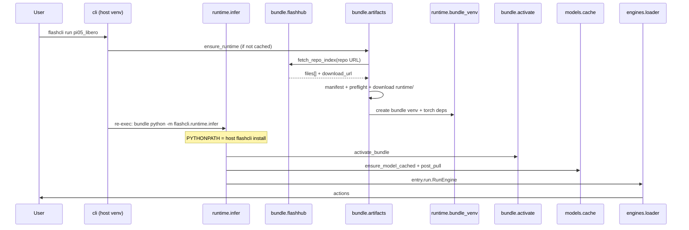

# Architecture

<p align="right"><strong>English</strong> · <a href="architecture.zh-CN.md">简体中文</a></p>

flashcli is the **distribution and runtime host** for FlashRT: it resolves presets, fetches Model Bundles from FlashHub, preflights the host GPU environment, creates a bundle venv, caches weights, and calls `RunEngine` / `ServeEngine` from each bundle’s **`entry`**.

It does **not** implement model forward passes or CUDA kernels; those live in bundle modules such as `run.py` (and optional `flash_rt/` / `.so` files).

## Core principles

1. **Inference lives in the bundle** — `entry` in `flashcli-bundle.json`; flashcli only `importlib`-loads it.
2. **Minimal catalog** — `models.yaml` has preset names and `bundle.repo` (or local `path`).
3. **Manifest-first + split download** — fetch manifest → preflight against `runtime` keys → download only this host’s `runtime/<env-key>/`.
4. **Fixed Python ABI** — one venv per bundle (`python_abi`); CLI **re-execs** into that venv after prepare.
5. **Single host flashcli install** — the CLI package is **never** pip-installed into bundle venvs; bundle venvs install **`flashcli-bundle`** only (protocol + manifest). Host flashcli loads via `PYTHONPATH` for `runtime.infer` (see below).
6. **One command** — `flashcli run <preset>` chains sync → deps → weights → `post_pull` → inference.

## Host CLI vs bundle infer (important)

`flashcli pull` / `bundle sync` / weight download run in the **host CLI venv** (e.g. Python 3.10 from `install.sh`).  
`flashcli run` / `serve` prepare the bundle, then **re-exec** into the **bundle venv** (e.g. Python 3.12 from `python_abi`).

| What | Where it lives | Installed how |
|------|----------------|---------------|
| `flashcli` CLI + infer modules | Host only (`~/.flashcli/venv` or editable `src/`) | `install.sh` / `auto_install.sh` **once** |
| **`flashcli-bundle`** (protocol, manifest options) | Host + bundle venv | Git: `flashcli-bundle @ git+…#subdirectory=flashcli-bundle` (see `install.sh`, `~/.flashcli/install.env`) |
| Bundle inference stack (torch, numpy, …) | `~/.flashcli/runtimes/<id>/venv/` | From `flashcli-bundle.json` → `python_dependencies` |
| Infer helper deps (typer, pyyaml, fastapi, …) | Same bundle venv, **only if missing** | `ensure_bundle_infer_deps()` — **not** the flashcli package |

**Re-exec command** (inside bundle venv):

```text
bundle_venv/bin/python /path/to/host/flashcli/runtime/infer_launch.py run|serve …
```

``infer_launch.py`` inserts the host install into ``sys.path`` (also sets ``PYTHONPATH`` as backup). Implementation: `runtime/reexec.py`, `runtime/infer_launch.py`, `runtime/infer.py`.

### Do not (common mistakes)

- **Do not** `pip install flashcli` into the bundle venv — dev versions are often absent from PyPI.
- **Do not** duplicate flashcli per `python_abi` — host `sys.path` bootstrap is shared; only bundle **deps** may differ by ABI.

During `activate_bundle()`, `PYTHONPATH` also prepends the **bundle root** so `entry` and `flash_rt` import correctly (separate from host flashcli on `PYTHONPATH` during re-exec).

## Boundary with FlashRT

| Responsibility | flashcli | Model Bundle |
|----------------|----------|----------------|
| `models.yaml` | ✓ | |
| `flashcli-bundle.json` | | ✓ |
| FlashHub fetch / local `path` | ✓ | |
| bundle venv, PYTHONPATH, pip | ✓ | `python_dependencies` |
| OpenAI HTTP (`serve`) | ✓ | |
| `RunEngine` / `ServeEngine` | | ✓ |
| `flash_rt`, `*.so` | | ✓ |

flashcli does **not** pip-depend on `flash-rt`. `import flash_rt` is only valid after `activate_bundle()`.

## Data flow (`flashcli run pi05_libero`)



**Resolution order**: `--bundle` > catalog `path` > synced runtime cache (`FLASHCLI_BUNDLE_ROOT`); catalog `repo` is populated via `bundle sync`.

## Local directories

```text
~/.flashcli/
├── venv/                    # host CLI (flashcli installed once)
├── python/                  # optional standalone Pythons for bundle venv base
├── runtimes/<id>/           # bundle root + lib/ + venv/
├── cache/repo-index/        # FlashHub listing cache
└── models/<preset>/checkpoint/
```

## Bundle layout (after sync)

```text
{bundle_root}/
├── flashcli-bundle.json
├── run.py
├── lib/                       # *.so for this host
└── flash_rt/
```

See [model_bundle_standard.md](model_bundle_standard.md).

## Module map

| Package | Role |
|---------|------|
| `bundle/catalog.py` | Read `models.yaml`; resolve `bundle.repo` |
| `bundle/flashhub.py` | FlashHub API listing and file download |
| `bundle/artifacts.py` | Manifest-first runtime assembly |
| `bundle/preflight.py` | Match host env key to `runtime` |
| `bundle/resolve.py` | `--bundle` / `path` / synced cache |
| `bundle/activate.py` | PYTHONPATH, deps, preload `.so` |
| `runtime/bundle_venv.py` | Create venv from `python_abi` |
| `runtime/reexec.py` | Host prepare → re-exec into bundle venv |
| `runtime/infer_launch.py` | Bootstrap: prepend host flashcli to `sys.path` |
| `runtime/infer.py` | `run` / `serve` inside bundle venv |
| `runtime/flashcli_shared.py` | Host `PYTHONPATH` for infer (no second flashcli install) |
| `deps.py` | `ensure_bundle_infer_deps()` — typer/yaml/… into bundle venv only |
| `models/cache.py` | Weights + `post_pull` |
| `engines/loader.py` | Load `entry` |

## Current catalog

| Preset | capabilities | bundle source |
|--------|--------------|---------------|
| `pi05_libero` | `run` | FlashHub `…/pi05_libero/1.0.2` |
| `qwen3-8b-nvfp4` | `run`, `serve` | shared repo with qwen36, `bundle_variant: qwen3` |
| `qwen36-27b-nvfp4` | `run`, `serve` | shared repo with qwen3, `bundle_variant: qwen36` |

## Related docs

- [model_bundle_standard.md](model_bundle_standard.md) — bundle format and catalog
- [runtime-package-schemes.md](runtime-package-schemes.md) — implemented split-download scheme
