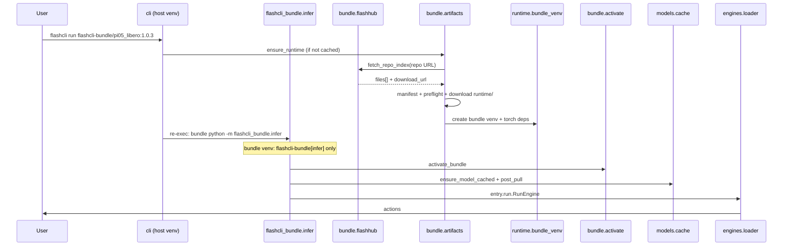

# Architecture

<p align="right"><strong>English</strong> · <a href="architecture.zh-CN.md">简体中文</a></p>

flashcli is the **distribution and runtime host** for FlashRT: it resolves presets, fetches Model Bundles from FlashHub, preflights the host GPU environment, creates a bundle venv, caches weights, and calls `RunEngine` / `ServeEngine` from each bundle’s **`entry`**.

It does **not** implement model forward passes or CUDA kernels; those live in bundle modules such as `run.py` (and optional `flash_rt/` / `.so` files).

## Core principles

1. **Inference lives in the bundle** — `entry` in `flashcli-bundle.json`; flashcli only `importlib`-loads it.
2. **Preset ref** — users pass `namespace/bundle:version[@variant]`; `FLASHCLI_FLASHHUB_API` sets the API base.
3. **Manifest-first + split download** — fetch manifest → preflight against `runtime` keys → download only this host’s `runtime/<env-key>/`.
4. **Fixed Python ABI** — one venv per bundle (`python_abi`); CLI **re-execs** into that venv after prepare.
5. **Single host flashcli install** — host venv installs **`flashcli-bundle`** (protocol only); bundle venvs install **`flashcli-bundle[infer]`**. Host code **must not** `import flashcli_bundle.infer`.
6. **One command** — `flashcli run <ref>` chains sync → deps → weights → `post_pull` → inference.

## Host CLI vs bundle infer (important)

`flashcli pull` / `bundle sync` / weight download run in the **host CLI venv** (e.g. Python 3.10 from `install.sh`).  
`flashcli run` / `serve` prepare the bundle, then **re-exec** into the **bundle venv** (e.g. Python 3.12 from `python_abi`).

| What | Where it lives | Installed how |
|------|----------------|---------------|
| `flashcli` CLI (pull, sync, doctor) | Host only (`~/.flashcli/venv` or editable `src/`) | `install.sh` / `auto_install.sh` **once** |
| **`huggingface_hub`** (Hub CLI, weight pull) | **Host only** | `pyproject.toml` — **not** installed into bundle venv |
| **`flashcli-bundle`** (protocol) | Host only | Git: `flashcli-bundle @ git+…#subdirectory=flashcli-bundle` |
| **`flashcli-bundle[infer]`** | Bundle venv only | Same git source with `[infer]` extra |
| Bundle inference stack (torch, transformers, …) | `~/.flashcli/runtimes/<id>/venv/` | From `flashcli-bundle.json` → `python_dependencies` |
| Bundle venv infer entrypoint | Same bundle venv | `ensure_flashcli_bundle_in_venv(..., extras=("infer",))` — **no** host `flashcli` package |

**Dependency isolation:** Host and bundle venvs are separate. flashcli never pins `transformers` or caps `huggingface_hub` for the bundle stack — bundle `python_dependencies` (e.g. `transformers<4.56`) resolve their own transitive deps inside the bundle venv. Weight download (`flashcli pull`, or auto-pull before `run`/`serve`) runs on the **host** only; the bundle infer subprocess resolves cached or bundle-local paths only.

### Pip dependency layers

| Layer | Venv | Installed via | Must not |
|-------|------|---------------|----------|
| `flashcli` | Host | `pyproject.toml` | import `flashcli_bundle.infer` |
| `flashcli-bundle` | Host | `install.sh` (no extras) | — |
| `flashcli-bundle[infer]` | Bundle | `ensure_flashcli_bundle_in_venv(..., extras=("infer",))` | import host `flashcli` |
| Manifest `python_dependencies` | Bundle | `activate_bundle` / `bundle install` | pin host `huggingface_hub` |

Structural tests: `tests/test_architecture_layers.py`.

**Re-exec command** (inside bundle venv):

```text
bundle_venv/bin/python -m flashcli_bundle.infer run|serve …
```

The bundle venv does **not** prepend host `PYTHONPATH` or import host `flashcli`. Implementation: `runtime/reexec.py`, `flashcli_bundle.infer` in `flashcli-bundle[infer]`.

### Do not (common mistakes)

- **Do not** `pip install flashcli` into the bundle venv — dev versions are often absent from PyPI; use `flashcli-bundle[infer]` instead.
- **Do not** prepend host `PYTHONPATH` or import host `flashcli` in the bundle infer process.

During `activate_bundle()`, `PYTHONPATH` prepends the **bundle root** so `entry` and `flash_rt` import correctly.

## Boundary with FlashRT

| Responsibility | flashcli | Model Bundle |
|----------------|----------|----------------|
| Preset ref / FlashHub | ✓ | |
| `flashcli-bundle.json` | | ✓ |
| FlashHub fetch / local `path` | ✓ | |
| bundle venv, PYTHONPATH, pip | ✓ | `python_dependencies` |
| OpenAI HTTP (`serve`) | ✓ | |
| `RunEngine` / `ServeEngine` | | ✓ |
| `flash_rt`, `*.so` | | ✓ |

flashcli does **not** pip-depend on `flash-rt`. `import flash_rt` is only valid after `activate_bundle()`.

## Data flow (`flashcli run flashcli-bundle/pi05_libero:1.0.3`)



**Resolution order**: local positional path (directory with `flashcli-bundle.json`) > synced runtime cache (`FLASHCLI_BUNDLE_ROOT` / preset marker); FlashHub ref `repo` is populated via `bundle sync`.

## Local directories

```text
~/.flashcli/
├── venv/                    # host CLI (flashcli installed once)
├── python/                  # optional standalone Pythons for bundle venv base
├── runtimes/<id>/           # synced bundle root + bundle venv
├── bundles/<bundle>/<version>@<variant>/.flashcli_bundle.json
├── cache/repo-index/        # FlashHub listing cache
└── models/<bundle>/<version>@<variant>/checkpoint/
```

## Bundle layout (after sync)

```text
{bundle_root}/
├── flashcli-bundle.json
├── run.py
├── flash_rt/
└── runtime/<env-key>/       # native *.so for this host (loaded in place)
```

See [model_bundle_standard.md](model_bundle_standard.md).

## Module map

| Package | Role |
|---------|------|
| `models/preset_ref.py` | Parse ref → repo URL + variant + cache key |
| `bundle/catalog.py` | Resolve `bundle.repo` from preset ref |
| `bundle/flashhub.py` | FlashHub API listing and file download |
| `bundle/artifacts.py` | Manifest-first runtime assembly |
| `bundle/preflight.py` | Match host env key to `runtime` |
| `bundle/resolve.py` | Local path / synced cache |
| `bundle/activate.py` | PYTHONPATH, deps, preload `.so` |
| `runtime/bundle_venv.py` | Create venv from `python_abi` |
| `runtime/reexec.py` | Host prepare → `execve` `python -m flashcli_bundle.infer` |
| `flashcli_bundle.infer` | `run` / `serve` inside bundle venv |
| `deps.py` | Host pip + `flashcli-bundle`; bundle venv gets `[infer]` via `ensure_flashcli_bundle_in_venv` |
| `models/cache.py` | Host weight pull + cache; bundle infer resolve-only |
| `engines/loader.py` | Load `entry` |

## Example refs

| Ref | capabilities |
|-----|--------------|
| `flashcli-bundle/pi05_libero:1.0.3` | `run` |
| `flashcli-bundle/qwen_nvfp4:1.0.1@qwen3` | `run`, `serve` |
| `flashcli-bundle/qwen_nvfp4:1.0.1@qwen36` | `run`, `serve` |

See [model_bundle_standard.md](model_bundle_standard.md).

## Related docs

- [model_bundle_standard.md](model_bundle_standard.md) — preset ref + runtime flow
- [bundle_publish_standard.md](bundle_publish_standard.md) — manifest and entry spec
