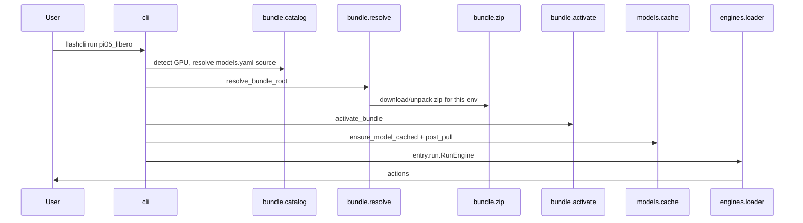

# Architecture

<p align="right"><strong>English</strong> · <a href="architecture.zh-CN.md">简体中文</a></p>

flashcli is the **distribution and runtime host** for FlashRT: it resolves presets, picks a bundle source for the current GPU environment, fetches Model Bundles, installs dependencies, caches weights, and calls `RunEngine` / `ServeEngine` from each bundle’s **`entry`**.

It does **not** implement model forward passes or CUDA kernels; those live in bundle modules such as `run.py` (and optional `flash_rt/` / `.so` files).

## Core principles

1. **Inference lives in the bundle** — `flashcli-bundle.json` `entry` points at modules; flashcli only `importlib`-loads them.
2. **Minimal catalog** — `models.yaml` contains only preset names and one bundle source per preset (`zip` / `path` / `git`).
3. **Environment-aware runtime** — detect `sm{SM}-cu{CUDA}-os-arch-py{PY}`, pick matching native `.so` from the bundle `lib/` matrix; clear error if no match.
4. **One command** — `flashcli run <preset>` chains: deps → bundle → weights → `post_pull` → inference.
5. **Optional HTTP** — `flashcli serve` is implemented by the bundle’s `ServeEngine`; the published `pi05_libero` preset supports **`run` only**.

## Boundary with FlashRT

| Responsibility | flashcli | Model Bundle |
|----------------|----------|----------------|
| `models.yaml` | ✓ | |
| `flashcli-bundle.json` | | ✓ |
| Resolve catalog by GPU; fetch zip/git/path | ✓ | |
| `activate_bundle`, PYTHONPATH, pip | ✓ | `python_dependencies` |
| OpenAI HTTP (`serve`) | ✓ | |
| `RunEngine` / `ServeEngine` | | ✓ |
| `flash_rt`, `*.so` | | ✓ (`modules[]`) |

flashcli does **not** pip-depend on `flash-rt`. `import flash_rt` is only valid after `activate_bundle()`.

## Data flow (`flashcli run pi05_libero`)



**Resolution order**: `--bundle` > catalog `zip` / `path` / `git` > local cache > download or clone; native `.so` selection uses the host runtime key inside the bundle.

## Local directories

```text
~/.flashcli/
├── bundles/<preset>/          # zip cache and .flashcli_bundle.json
└── models/<preset>/checkpoint/ # HF weights
```

## Bundle layout

```text
{bundle_root}/
├── flashcli-bundle.json
├── run.py                     # entry.run
├── lib/                       # native matrix (*.so)
└── flash_rt/                  # optional Python tree
```

See [model_bundle_standard.md](model_bundle_standard.md).

## Module map

| Package | Role |
|---------|------|
| `bundle/catalog.py` | Read `models.yaml`; one source per preset |
| `bundle/resolve.py` | `--bundle` > catalog source > path / zip / git cache |
| `bundle/zip.py` | CDN / local zip; locate `flashcli-bundle.json` after unpack |
| `bundle/git.py` | clone; locate flat bundle root |
| `bundle/activate.py` | PYTHONPATH, install deps, preload `.so` |
| `models/registry.py` | Read `models.yaml` |
| `models/cache.py` | Weights + `post_pull` |
| `engines/loader.py` | Load `entry` |
| `serve/app.py` | OpenAI routes (for `serve`) |

## Current catalog

| Preset | capabilities | bundle source |
|--------|--------------|---------------|
| `pi05_libero` | `run` | single `bundle.zip` (CDN matrix zip with `lib/*.so`) |

## Related docs

- [model_bundle_standard.md](model_bundle_standard.md) — bundle format and `models.yaml` conventions
