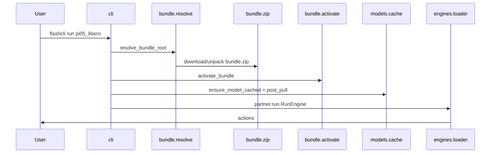

# Architecture

<p align="right"><strong>English</strong> · <a href="architecture.zh-CN.md">简体中文</a></p>

flashcli is the **distribution and runtime host** for FlashRT: it resolves presets, fetches Model Bundles, installs dependencies, caches weights, and calls **`partner.*`** `RunEngine` / `ServeEngine` inside each bundle.

It does **not** implement model forward passes or CUDA kernels; those live in `runtime/python/partner/` (and optional `flash_rt/`) inside each bundle.

## Core principles

1. **Inference lives in the bundle** — `flashcli-bundle.json` `entry` points at `partner` modules; flashcli only `importlib`-loads them.
2. **Minimal catalog** — `models.yaml` contains only preset names and bundle sources (`zip` / `path` / `git`).
3. **One command** — `flashcli run <preset>` chains: deps → bundle → weights → `post_pull` → inference.
4. **Optional HTTP** — `flashcli serve` is implemented by the bundle’s `ServeEngine`; the published `pi05_libero` preset supports **`run` only**.

## Boundary with FlashRT

| Responsibility | flashcli | Model Bundle |
|----------------|----------|----------------|
| `models.yaml` | ✓ | |
| `flashcli-bundle.json` | | ✓ |
| Download zip / git / local path | ✓ | |
| `activate_bundle`, PYTHONPATH, pip | ✓ | `runtime/manifest.json` |
| OpenAI HTTP (`serve`) | ✓ | |
| `RunEngine` / `ServeEngine` | | ✓ |
| `flash_rt`, `*.so` | | ✓ (`native_runtime: true`) |

flashcli does **not** pip-depend on `flash-rt`. `import flash_rt` is only valid after `activate_bundle()`.

## Data flow (`flashcli run pi05_libero`)



## Local directories

```text
~/.flashcli/
├── bundles/<preset>/          # unpacked runtime zip
└── models/<preset>/checkpoint/ # HF weights
```

## Bundle layout

```text
{bundle_root}/
├── flashcli-bundle.json
├── partner/                   # source; at runtime under runtime/python/partner/
└── runtime/
    ├── manifest.json
    ├── lib/*.so
    └── python/
        ├── partner/
        └── flash_rt/          # optional
```

## Module map

| Package | Role |
|---------|------|
| `bundle/resolve.py` | `--bundle` > `path` > zip cache |
| `bundle/zip.py` | CDN / local zip download and unpack |
| `bundle/activate.py` | PYTHONPATH, install deps, link `.so` |
| `models/registry.py` | Read `models.yaml` |
| `models/cache.py` | Weights + `post_pull` |
| `engines/loader.py` | Load `entry` |
| `serve/app.py` | OpenAI routes (for `serve`) |

## Current catalog

| Preset | capabilities | bundle source |
|--------|--------------|---------------|
| `pi05_libero` | `run` | `bundle.zip` (CDN) |

## Related docs

- [model_bundle_standard.md](model_bundle_standard.md) — bundle format
