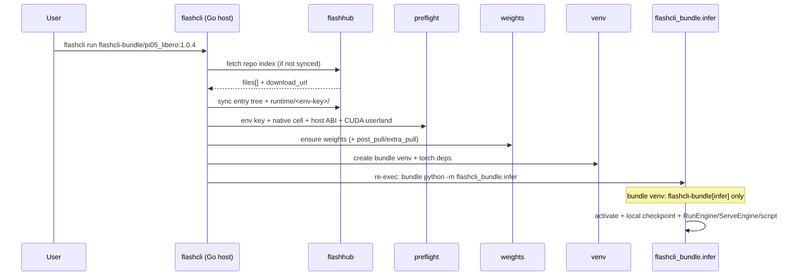

# Architecture

<p align="right"><strong>English</strong> · <a href="architecture.zh-CN.md">简体中文</a></p>

flashcli is the **distribution and runtime host** for FlashRT: it resolves presets, fetches Model Bundles from FlashHub, preflights the host GPU environment, creates a bundle venv, caches weights, and calls `RunEngine` / `ServeEngine` from each bundle’s **`entry`**.

It does **not** implement model forward passes or CUDA kernels; those live in bundle modules such as `run.py` (and optional `flash_rt/` / `.so` files).

> **Go host.** The host CLI is a static Go binary under `go/` (module `github.com/aodianyun/flashcli/go`); the Python host was removed. `flashcli-bundle/` remains: it is the **protocol** + **infer** package installed into bundle venvs (`flashcli-bundle[infer]`). Execution backends (`entry.kind`) are specified in [bundle_execution_abi.md](bundle_execution_abi.md).

## Core principles

1. **Inference lives in the bundle** — `entry` in `flashcli-bundle.json`; flashcli only `importlib`-loads it.
2. **Preset ref** — users pass `namespace/bundle:version[@variant]`; `FLASHCLI_FLASHHUB_API` sets the API base.
3. **Manifest-first + split download** — fetch manifest → preflight against `runtime` keys → download only this host’s `runtime/<env-key>/`.
4. **Fixed Python ABI** — one venv per bundle (`python_abi`); CLI **re-execs** into that venv after prepare.
5. **Single Go host** — the host is a static Go binary; bundle venvs pip-install **`flashcli-bundle[infer]`** (never a host `flashcli` package).
6. **One command** — `flashcli run <ref>` chains sync → deps → weights (host download if missing) → `post_pull` → offline inference in bundle venv.

### Where modules live (required reading)

**Host-only → `go/internal/`. Infer-only → `flashcli_bundle/infer/`. Both → `flashcli_bundle/` protocol.** Re-export is not an excuse to put single-layer logic in protocol. See [module_layers.md](module_layers.md).

## Host CLI vs bundle infer (important)

`flashcli pull` / `bundle sync` / weight download run in the **Go host**.  
`flashcli run` / `serve` prepare the bundle, then either **re-exec** into the **bundle venv** (`python -m flashcli_bundle.infer`) for `entry.kind: python`, or drive a **native** backend for `native-exec` / `native-abi`.

| What | Where it lives | Installed how |
|------|----------------|---------------|
| `flashcli` CLI (pull, sync, doctor) | Go binary on PATH (`go/`) | `install.sh` |
| **`flashcli-bundle`** (protocol) | Host (build/dev) | `flashcli-bundle/` source |
| **`flashcli-bundle[infer]`** | Bundle venv only | `venv.Ensure` → pip (`FLASHCLI_BUNDLE_PIP_SPEC` / repo / local checkout) |
| Bundle inference stack (torch, transformers, …) | `~/.flashcli/runtimes/<id>/venv/` | From `flashcli-bundle.json` → `python_dependencies` |
| Bundle venv infer entrypoint | Same bundle venv | `python -m flashcli_bundle.infer` — **no** host package |

**Dependency isolation:** the host never installs into the bundle venv except `flashcli-bundle[infer]` and manifest `python_dependencies`. Weight download runs on the **host** only; the bundle infer subprocess resolves cached or bundle-local paths only (`HF_HUB_OFFLINE=1`).

**Re-exec command** (inside bundle venv):

```text
bundle_venv/bin/python -m flashcli_bundle.infer run|serve …
```

The bundle venv does **not** prepend host `PYTHONPATH`. Implementation: Go `internal/{inferexec,nativeexec,nativeabi}` + `flashcli_bundle.infer` in `flashcli-bundle[infer]`.

### Do not (common mistakes)

- **Do not** prepend host `PYTHONPATH` or import a host `flashcli` package in the bundle infer process.
- **Do not** assume `flashcli` is pip-installable — it is a Go binary; only `flashcli-bundle` is Python.

During `activate_bundle()`, `PYTHONPATH` prepends the **bundle root** so `entry` and `flash_rt` import correctly.

## Boundary with FlashRT

| Responsibility | flashcli | Model Bundle |
|----------------|----------|----------------|
| Preset ref / FlashHub | ✓ | |
| `flashcli-bundle.json` | | ✓ |
| FlashHub fetch / local `path` | ✓ | |
| bundle venv, PYTHONPATH, pip | ✓ | `python_dependencies` |
| OpenAI HTTP (`serve`) | ✓ | |
| `RunEngine` / `ServeEngine` | | ✓ |
| `flash_rt`, `*.so` | | ✓ |

flashcli does **not** pip-depend on `flash-rt`. `import flash_rt` is only valid after `activate_bundle()`.

## Data flow (`flashcli run flashcli-bundle/pi05_libero:1.0.4`)


```mermaid
sequenceDiagram
  participant U as User
  participant CLI as flashcli (Go host)
  participant FH as flashhub
  participant Pre as preflight
  participant W as weights
  participant Venv as venv
  participant Infer as flashcli_bundle.infer

  U->>CLI: flashcli run flashcli-bundle/pi05_libero:1.0.4
  CLI->>FH: fetch repo index (if not synced)
  FH-->>CLI: files[] + download_url
  CLI->>FH: sync entry tree + runtime/<env-key>/
  CLI->>Pre: env key + native cell + host ABI + CUDA userland
  CLI->>W: ensure weights (+ post_pull/extra_pull)
  CLI->>Venv: create bundle venv + torch deps
  CLI->>Infer: re-exec: bundle python -m flashcli_bundle.infer
  Note over Infer: bundle venv: flashcli-bundle[infer] only
  Infer->>Infer: activate + local checkpoint + RunEngine/ServeEngine/script
```

**Entry modes**: `engine` (default) loads `RunEngine`/`ServeEngine` and parses manifest CLI options; `script` passes argv through to the bundle entry script; the host only uses `--checkpoint` for weight pull.

**Backends**: `entry.kind` selects `python` (re-exec, above), `native-exec` (host spawns), or `native-abi` (host `dlopen`s). See [bundle_execution_abi.md](bundle_execution_abi.md).

**Resolution order**: local positional path (directory with `flashcli-bundle.json`) > synced bundle cache (preset marker under `bundles/<cache-key>/`); FlashHub refs are synced via `bundle sync`.

## Local directories

```text
~/.flashcli/
├── install.env              # source hints for flashcli-bundle[infer] (repo/ref)
├── python/                  # optional standalone Pythons for bundle venv base
├── runtimes/<id>/           # bundle venv + .runtime.json marker
├── bundles/<bundle>/<version>@<variant>/.flashcli_bundle.json
├── cache/repo-index/        # FlashHub listing cache
└── models/<bundle>/<version>@<variant>/checkpoint/
```

## Bundle layout (after sync)

```text
{bundle_root}/
├── flashcli-bundle.json
├── run.py
├── flash_rt/
└── runtime/<env-key>/       # native *.so for this host (loaded in place)
```

See [model_bundle_standard.md](model_bundle_standard.md).

## Module map

Host (Go, `go/internal/`):

| Package | Role |
|---------|------|
| `ref` | Parse ref → repo URL + variant + cache key |
| `flashhub` | FlashHub API listing, file download, tree sync |
| `preflight` | Match host env key to `runtime`; native cell + host ABI + CUDA userland |
| `weights` | Weight cache, HF/ModelScope download, `post_pull`, `extra_pull` |
| `venv` | Create bundle venv from `python_abi`; resolve `flashcli-bundle[infer]` spec |
| `pythonprovision` | Resolve/install bundle base Python (standalone) |
| `inferexec` | Re-exec `python -m flashcli_bundle.infer` (python backend) |
| `nativeexec` | Spawn `native-exec` backend (NDJSON/HTTP) |
| `nativeabi` | `dlopen` `native-abi` model runtime (`frt_model_runtime_v1`) |
| `manifest`/`native`/`hostabi`/`cuda` | Manifest + native validation and host checks |
| `cli` | Command tree |

Bundle venv (Python, `flashcli-bundle/`):

| Module | Role |
|--------|------|
| `flashcli_bundle` (protocol) | Manifest/options/paths/FlashHub types |
| `flashcli_bundle.infer` | `run` / `serve` entry inside the bundle venv |

## Example refs

| Ref | capabilities |
|-----|--------------|
| `flashcli-bundle/pi05_libero:1.0.4` | `run` |
| `flashcli-bundle/qwen_nvfp4:1.0.1@qwen3` | `run`, `serve` |
| `flashcli-bundle/qwen_nvfp4:1.0.1@qwen36` | `run`, `serve` |
| `flashcli-bundle/qwen3_vl_nvfp4:1.0.0` | `run`, `serve` |
| `bundles/groot_n16` *(local dev)* | `run` |
| `bundles/groot_n17` *(local dev)* | `run` |

See [model_bundle_standard.md](model_bundle_standard.md).

## Related docs

- [module_layers.md](module_layers.md) — three-layer module ownership and import rules
- [model_bundle_standard.md](model_bundle_standard.md) — preset ref + runtime flow
- [bundle_publish_standard.md](bundle_publish_standard.md) — manifest and entry spec
- [bundle_execution_abi.md](bundle_execution_abi.md) — execution backends (`entry.kind`) and native contracts
