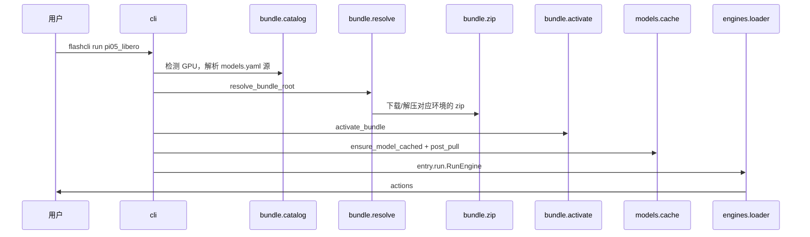

# 架构说明

<p align="right"><a href="architecture.md">English</a> · <strong>简体中文</strong></p>

flashcli 是 FlashRT 的**分发与运行宿主**：解析 preset、按 GPU 环境选择 bundle 源、获取 Model Bundle、安装依赖、缓存权重，并调用 bundle 内 **`entry`** 指向的 `RunEngine` / `ServeEngine`。

**不负责**具体模型 forward、CUDA kernel；这些在 bundle 的 `run.py`（及可选 `flash_rt/`、`.so`）中实现。

## 核心原则

1. **推理在 bundle 内** — `flashcli-bundle.json` 的 `entry` 指向模块；flashcli 只做 `importlib` 加载。
2. **catalog 极简** — `models.yaml` 仅含 preset 名与 bundle 源（`zip` / `path` / `git`，或多环境 `bundle.variants`）。
3. **按环境选源** — 检测 `sm{SM}-cu{CUDA}-os-arch`，从 catalog 或包内 `variants/` 选取匹配 bundle；无匹配项时给出已配置环境列表。
4. **一条命令** — `flashcli run <preset>` 串联：依赖 → bundle → 权重 → `post_pull` → 推理。
5. **可选 HTTP** — `flashcli serve` 由 bundle 实现 `ServeEngine`；当前发布的 `pi05_libero` 仅 `run`。

## 与 FlashRT 的边界

| 职责 | flashcli | Model Bundle |
|------|----------|----------------|
| `models.yaml` | ✓ | |
| `flashcli-bundle.json` | | ✓ |
| 按 GPU 解析 catalog / 下载 zip·git·path | ✓ | |
| `activate_bundle`、PYTHONPATH、pip | ✓ | `python_dependencies` |
| OpenAI HTTP（`serve`） | ✓ | |
| `RunEngine` / `ServeEngine` | | ✓ |
| `flash_rt`、`*.so` | | ✓（`modules[]`） |

flashcli **不** pip 依赖 `flash-rt`。`import flash_rt` 仅在 `activate_bundle()` 之后可用。

## 数据流（`flashcli run pi05_libero`）



**Bundle 解析顺序**：`--bundle` > **catalog 按 GPU 选源**（`bundle.variants` 或顶层单源）> 本地缓存 > zip 下载/解压 或 git clone >（单 zip/git 包时）包内 `variants/<env>/`。

## 本机目录

```text
~/.flashcli/
├── bundles/<preset>/          # zip 缓存与 .flashcli_bundle.json
└── models/<preset>/checkpoint/ # HF 权重
```

## Bundle 布局（`format_version` ≥ 2）

```text
{bundle_root}/
├── flashcli-bundle.json
├── run.py                     # entry.run
├── flash_rt_kernels.so        # modules[].file
└── flash_rt/                  # 可选 Python 树
```

旧版 `runtime/manifest.json` + `runtime/python/partner/` 仍兼容，见 [model_bundle_standard.zh-CN.md](model_bundle_standard.zh-CN.md)。

## 模块划分

| 包 | 职责 |
|----|------|
| `bundle/catalog.py` | 读 `models.yaml`，按 GPU 解析 `bundle.variants` 或单源 |
| `bundle/resolve.py` | `--bundle` > catalog 源 > path / zip / git 缓存 |
| `bundle/zip.py` | CDN / 本地 zip；解压后可选包内 `variants/` |
| `bundle/git.py` | clone；仓内 `variants/<env>/` 或扁平根 |
| `bundle/activate.py` | PYTHONPATH、装依赖、预加载 `.so` |
| `models/registry.py` | 读 `models.yaml` |
| `models/cache.py` | 权重 + `post_pull` |
| `engines/loader.py` | 加载 `entry` |
| `serve/app.py` | OpenAI 路由（`serve` 用） |

## 当前 catalog

| Preset | capabilities | bundle 源 |
|--------|--------------|---------|
| `pi05_libero` | `run` | `bundle.variants`（当前 CDN：sm89-cu124-linux-x86_64） |

## 相关文档

- [model_bundle_standard.zh-CN.md](model_bundle_standard.zh-CN.md) — 包格式与 `models.yaml` 约定
