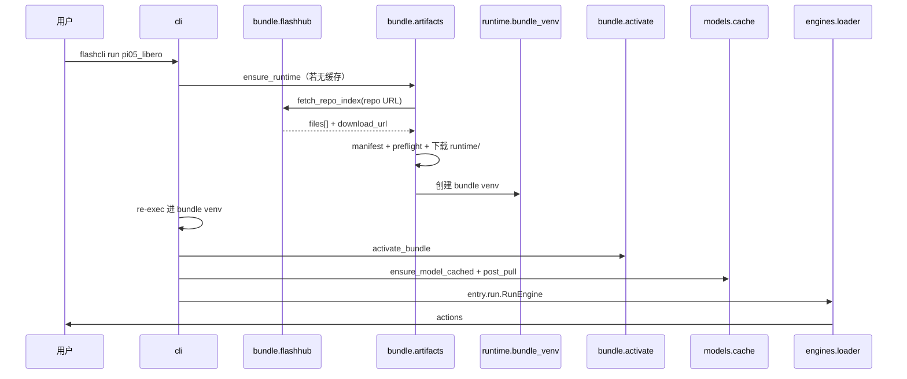

# 架构说明

<p align="right"><a href="architecture.md">English</a> · <strong>简体中文</strong></p>

flashcli 是 FlashRT 的**分发与运行宿主**：解析 preset、从 FlashHub 拉取 Model Bundle、按 GPU 环境 preflight、创建 bundle venv、缓存权重，并调用 bundle 内 **`entry`** 的 `RunEngine` / `ServeEngine`。

**不负责**具体模型 forward、CUDA kernel；这些在 bundle 的 `run.py`（及 `flash_rt/`、`.so`）中实现。

## 核心原则

1. **推理在 bundle 内** — `flashcli-bundle.json` 的 `entry` 指向模块；flashcli 只做 `importlib` 加载。
2. **catalog 极简** — `models.yaml` 仅含 preset 名与 `bundle.repo`（或本地 `path`）。
3. **manifest-first + 分包下载** — 先拉 manifest → preflight 匹配 `runtime` env key → 只下载本 env 的 `runtime/<env-key>/`。
4. **固定 Python ABI** — 每个 bundle 一个 venv（`python_abi`）；CLI 准备完成后 **re-exec** 进 bundle venv。
5. **一条命令** — `flashcli run <preset>` 串联：sync → 依赖 → 权重 → `post_pull` → 推理。

## 与 FlashRT 的边界

| 职责 | flashcli | Model Bundle |
|------|----------|----------------|
| `models.yaml` | ✓ | |
| `flashcli-bundle.json` | | ✓ |
| FlashHub 拉取 / 本地 `path` | ✓ | |
| bundle venv、PYTHONPATH、pip | ✓ | `python_dependencies` |
| OpenAI HTTP（`serve`） | ✓ | |
| `RunEngine` / `ServeEngine` | | ✓ |
| `flash_rt`、`*.so` | | ✓ |

flashcli **不** pip 依赖 `flash-rt`。`import flash_rt` 仅在 `activate_bundle()` 之后可用。

## 数据流（`flashcli run pi05_libero`）



**Bundle 解析顺序**：`--bundle` > catalog `path` > 已 sync 的 runtime 缓存（`FLASHCLI_BUNDLE_ROOT`）；catalog `repo` 由 `bundle sync` 填充缓存。

## 本机目录

```text
~/.flashcli/
├── runtimes/<id>/           # bundle 根 + lib/ + venv/
├── cache/repo-index/        # FlashHub listing 缓存
└── models/<preset>/checkpoint/
```

## Bundle 布局（sync 后）

```text
{bundle_root}/
├── flashcli-bundle.json
├── run.py
├── lib/                       # 本机 env 的 *.so
└── flash_rt/
```

详见 [model_bundle_standard.zh-CN.md](model_bundle_standard.zh-CN.md)。

## 模块划分

| 包 | 职责 |
|----|------|
| `bundle/catalog.py` | 读 `models.yaml`；解析 `bundle.repo` |
| `bundle/flashhub.py` | FlashHub API  listing / 文件下载 |
| `bundle/artifacts.py` | manifest-first 组装 runtime |
| `bundle/preflight.py` | env key 与 `runtime` 匹配 |
| `bundle/resolve.py` | `--bundle` / `path` / 已 sync 缓存 |
| `bundle/activate.py` | PYTHONPATH、依赖、预加载 `.so` |
| `runtime/bundle_venv.py` | 按 `python_abi` 创建 venv |
| `models/cache.py` | 权重 + `post_pull` |
| `engines/loader.py` | 加载 `entry` |

## 当前 catalog

| Preset | 能力 | bundle 源 |
|--------|------|-----------|
| `pi05_libero` | `run` | FlashHub `…/pi05_libero/1.0.2` |
| `qwen3-8b-nvfp4` | `run`, `serve` | 与 qwen36 共享 repo，`bundle_variant: qwen3` |
| `qwen36-27b-nvfp4` | `run`, `serve` | 与 qwen3 共享 repo，`bundle_variant: qwen36` |

## 相关文档

- [model_bundle_standard.zh-CN.md](model_bundle_standard.zh-CN.md) — 包格式与 catalog
- [runtime-package-schemes.zh-CN.md](runtime-package-schemes.zh-CN.md) — 已实施的分包方案
