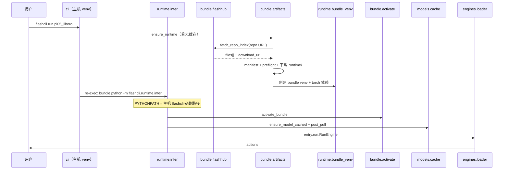

# 架构说明

<p align="right"><a href="architecture.md">English</a> · <strong>简体中文</strong></p>

flashcli 是 FlashRT 的**分发与运行宿主**：解析 preset、从 FlashHub 拉取 Model Bundle、按 GPU 环境 preflight、创建 bundle venv、缓存权重，并调用 bundle 内 **`entry`** 的 `RunEngine` / `ServeEngine`。

**不负责**具体模型 forward、CUDA kernel；这些在 bundle 的 `run.py`（及 `flash_rt/`、`.so`）中实现。

## 核心原则

1. **推理在 bundle 内** — `flashcli-bundle.json` 的 `entry` 指向模块；flashcli 只做 `importlib` 加载。
2. **catalog 极简** — `models.yaml` 仅含 preset 名与 `bundle.repo`（或本地 `path`）。
3. **manifest-first + 分包下载** — 先拉 manifest → preflight 匹配 `runtime` env key → 只下载本 env 的 `runtime/<env-key>/`。
4. **固定 Python ABI** — 每个 bundle 一个 venv（`python_abi`）；CLI 准备完成后 **re-exec** 进 bundle venv。
5. **主机只装一份 flashcli** — **绝不**向 bundle venv pip 安装 flashcli；bundle Python 通过 `PYTHONPATH` 加载主机上的包（见下节）。
6. **一条命令** — `flashcli run <preset>` 串联：sync → 依赖 → 权重 → `post_pull` → 推理。

## 主机 CLI 与 bundle infer（必读）

`flashcli pull` / `bundle sync` / 权重下载在**主机 CLI venv**（如 `install.sh` 的 Python 3.10）中执行。  
`flashcli run` / `serve` 先准备 bundle，再 **re-exec** 到 **bundle venv**（如 manifest 的 Python 3.12）。

| 内容 | 位置 | 安装方式 |
|------|------|----------|
| `flashcli` CLI + infer 模块 | 仅主机（`~/.flashcli/venv` 或 editable `src/`） | `install.sh` / `pip install flashcli`，**只装一次** |
| 推理栈（torch、numpy…） | `~/.flashcli/runtimes/<id>/venv/` | `flashcli-bundle.json` → `python_dependencies` |
| infer 辅助依赖（typer、pyyaml、fastapi…） | 同上 bundle venv，**缺啥装啥** | `ensure_bundle_infer_deps()` — **不含** flashcli 包本身 |

**Re-exec 命令**（在 bundle venv 内）：

```text
PYTHONPATH=<主机 flashcli 的 src 或 site-packages>
  bundle_venv/bin/python -m flashcli.runtime.infer run|serve …
```

实现：`runtime/reexec.py`、`runtime/infer.py`、`runtime/flashcli_shared.py`（`host_flashcli_pythonpath()`）。

### 禁止事项（避免再次跑偏）

- **不要**在 bundle venv 里 `pip install flashcli` — dev 版本通常不在 PyPI。
- **不要**再维护 `~/.flashcli/share/flashcli/` — 已废弃的中间方案，有残留可 `rm -rf`。
- **不要**按 `python_abi` 再复制一份 flashcli — 主机 `PYTHONPATH` 共用即可；按 ABI 变化的只有 bundle **依赖**。

`activate_bundle()` 还会把 **bundle 根目录** prepend 到 `PYTHONPATH`，以便 `import entry` / `flash_rt`（与 re-exec 时加载主机 flashcli 是两层不同用途）。

## 与 FlashRT 的边界

| 职责 | flashcli | Model Bundle |
|------|----------|----------------|
| `models.yaml` | ✓ | |
| `flashcli-bundle.json` | | ✓ |
| FlashHub 拉取 / 本地 `path` | ✓ | |
| bundle venv、PYTHONPATH、pip | ✓ | `python_dependencies` |
| OpenAI HTTP（`serve`） | ✓ | |
| `RunEngine` / `ServeEngine` | | ✓ |
| `flash_rt`、`*.so` | | ✓ |

flashcli **不** pip 依赖 `flash-rt`。`import flash_rt` 仅在 `activate_bundle()` 之后可用。

## 数据流（`flashcli run pi05_libero`）



**Bundle 解析顺序**：`--bundle` > catalog `path` > 已 sync 的 runtime 缓存（`FLASHCLI_BUNDLE_ROOT`）；catalog `repo` 由 `bundle sync` 填充缓存。

## 本机目录

```text
~/.flashcli/
├── venv/                    # 主机 CLI（flashcli 只装此处）
├── python/                  # 可选：standalone Python，供 bundle venv 使用
├── runtimes/<id>/           # bundle 根 + lib/ + venv/
├── cache/repo-index/        # FlashHub listing 缓存
└── models/<preset>/checkpoint/
```

**已废弃：** `~/.flashcli/share/flashcli/` — 旧版 infer 复制目录，可安全删除。

## Bundle 布局（sync 后）

```text
{bundle_root}/
├── flashcli-bundle.json
├── run.py
├── lib/                       # 本机 env 的 *.so
└── flash_rt/
```

详见 [model_bundle_standard.zh-CN.md](model_bundle_standard.zh-CN.md)。

## 模块划分

| 包 | 职责 |
|----|------|
| `bundle/catalog.py` | 读 `models.yaml`；解析 `bundle.repo` |
| `bundle/flashhub.py` | FlashHub API  listing / 文件下载 |
| `bundle/artifacts.py` | manifest-first 组装 runtime |
| `bundle/preflight.py` | env key 与 `runtime` 匹配 |
| `bundle/resolve.py` | `--bundle` / `path` / 已 sync 缓存 |
| `bundle/activate.py` | PYTHONPATH、依赖、预加载 `.so` |
| `runtime/bundle_venv.py` | 按 `python_abi` 创建 venv |
| `runtime/reexec.py` | 主机准备 → re-exec 进 bundle venv |
| `runtime/infer.py` | 在 bundle venv 内执行 `run` / `serve` |
| `runtime/flashcli_shared.py` | 主机 `PYTHONPATH`，不二次安装 flashcli |
| `deps.py` | `ensure_bundle_infer_deps()` — 仅 typer/yaml/… 进 bundle venv |
| `models/cache.py` | 权重 + `post_pull` |
| `engines/loader.py` | 加载 `entry` |

## 当前 catalog

| Preset | 能力 | bundle 源 |
|--------|------|-----------|
| `pi05_libero` | `run` | FlashHub `…/pi05_libero/1.0.2` |
| `qwen3-8b-nvfp4` | `run`, `serve` | 与 qwen36 共享 repo，`bundle_variant: qwen3` |
| `qwen36-27b-nvfp4` | `run`, `serve` | 与 qwen3 共享 repo，`bundle_variant: qwen36` |

## 相关文档

- [model_bundle_standard.zh-CN.md](model_bundle_standard.zh-CN.md) — 包格式与 catalog
- [runtime-package-schemes.zh-CN.md](runtime-package-schemes.zh-CN.md) — 已实施的分包方案
