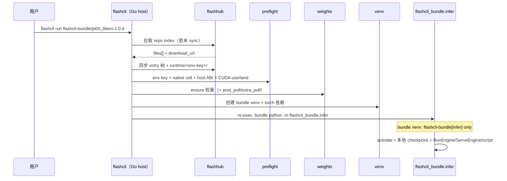

# 架构说明

<p align="right"><a href="architecture.md">English</a> · <strong>简体中文</strong></p>

flashcli 是 FlashRT 的**分发与运行宿主**：解析 preset、从 FlashHub 拉取 Model Bundle、按 GPU 环境 preflight、创建 bundle venv、缓存权重，并调用 bundle 内 **`entry`** 的 `RunEngine` / `ServeEngine`。

**不负责**具体模型 forward、CUDA kernel；这些在 bundle 的 `run.py`（及 `flash_rt/`、`.so`）中实现。**仅原生** bundle 则改用原生 model-runtime ABI、无 Python entry（`entry.kind = native-abi|native-exec`；见 [bundle_execution_abi.zh-CN.md](bundle_execution_abi.zh-CN.md)）。

> **Go host。** 主机 CLI 是 `go/`（module `github.com/aodianyun/flashcli/go`）下的静态 Go 二进制；Python host 已移除。`flashcli-bundle/` 保留：它是装进 bundle venv 的 **protocol** + **infer** 包（`flashcli-bundle[infer]`）。执行 backend（`entry.kind`）规范见 [bundle_execution_abi.zh-CN.md](bundle_execution_abi.zh-CN.md)。

## 核心原则

1. **推理在 bundle 内** — bundle 拥有**全部模型专属逻辑**：前向、预处理/后处理、模态形状与 dtype、输入/输出语义、option→端口映射与默认值。flashcli 只是**通用、与模型无关的驱动器**：解析 ref、准备环境、调用 bundle 提供的接口——`kind=python` 用 `entry`，`native-exec`/`native-abi` 用声明的 model-runtime ABI + manifest `native` 块。**host（`go/`）中不得出现任何模型专属常量、形状或预处理。**
2. **Preset ref** — 用户使用 `namespace/bundle:version[@variant]`；`FLASHCLI_FLASHHUB_API` 配置 API 基址。
3. **manifest-first + 分包下载** — 先拉 manifest → preflight 匹配 `runtime` env key → 只下载本 env 的 `runtime/<env-key>/`。
4. **固定 Python ABI** — 每个 bundle 一个 venv（`python_abi`）；CLI 准备完成后 **re-exec** 进 bundle venv。
5. **单一 Go 主机** — 主机为 `go/` 静态二进制；bundle venv 仅 pip **`flashcli-bundle[infer]`**（protocol + infer）。
6. **一条命令** — `flashcli run <preset>` 串联：sync → 依赖 → 权重（主机缺失则下载）→ `post_pull` → bundle venv 内离线推理。

### 模块放哪（必读）

**主机（Go）→ `go/internal/*`；只有 infer 用到 → `flashcli_bundle/infer/`；两层都用 → `flashcli_bundle/` protocol。** Re-export 不能作为把逻辑塞进 protocol 的理由。详见 [module_layers.zh-CN.md](module_layers.zh-CN.md)。

## 主机 CLI 与 bundle infer（必读）

`flashcli pull` / `bundle sync` / 权重下载在 **Go 主机**中执行。  
`flashcli run` / `serve` 先准备 bundle，随后：`entry.kind: python` 时 **re-exec** 到 **bundle venv**（`python -m flashcli_bundle.infer`）；`native-exec` / `native-abi` 时驱动原生 backend。

| 内容 | 位置 | 安装方式 |
|------|------|----------|
| `flashcli` CLI | PATH 上的 Go 二进制（`go/`） | `install.sh` |
| **`flashcli-bundle`**（协议） | 主机（build/开发） | `flashcli-bundle/` 源码 |
| **`flashcli-bundle[infer]`** | 仅 bundle venv | `venv.Ensure` → pip（`FLASHCLI_BUNDLE_PIP_SPEC` / repo / 本地 checkout） |
| 推理栈（torch、transformers…） | `~/.flashcli/runtimes/<id>/venv/` | `flashcli-bundle.json` → `python_dependencies` |

**依赖隔离：** 主机除 `flashcli-bundle[infer]` 与 manifest `python_dependencies` 外不向 bundle venv 安装任何东西。权重下载仅在**主机**执行；bundle infer 子进程只解析缓存或 bundle 本地路径（`HF_HUB_OFFLINE=1`）。

**Re-exec 命令**（在 bundle venv 内）：

```text
bundle_venv/bin/python -m flashcli_bundle.infer run|serve …
```

bundle venv **不** prepend 主机 `PYTHONPATH`。实现：Go `internal/{inferexec,nativeexec,nativeabi}` + `flashcli-bundle` 的 `flashcli_bundle.infer`。

### 禁止事项（避免再次跑偏）

- **不要**在 bundle venv 里 `pip install flashcli` — infer 在 `flashcli-bundle[infer]` 中。
- **不要**把主机 ``site-packages`` 或主机 ``flashcli`` 放进 bundle 进程的 ``PYTHONPATH`` — 否则主机的 ``huggingface_hub`` 1.x 会泄漏到 bundle（实现 bug，非设计）。

`activate_bundle()` 还会把 **bundle 根目录** prepend 到 `PYTHONPATH`，以便 `import entry` / `flash_rt`。

## 与 FlashRT 的边界

| 职责 | flashcli | Model Bundle |
|------|----------|----------------|
| Preset ref / FlashHub | ✓ | |
| `flashcli-bundle.json` | | ✓ |
| FlashHub 拉取 / 本地 `path` | ✓ | |
| bundle venv、PYTHONPATH、pip | ✓ | `python_dependencies` |
| OpenAI HTTP（`serve`） | ✓ | |
| `RunEngine` / `ServeEngine` | | ✓ |
| `flash_rt`、`*.so` | | ✓ |

flashcli **不** pip 依赖 `flash-rt`。`import flash_rt` 仅在 `activate_bundle()` 之后可用。

## 数据流（`flashcli run flashcli-bundle/pi05_libero:1.0.4`）


```mermaid
sequenceDiagram
  participant U as 用户
  participant CLI as flashcli（Go host）
  participant FH as flashhub
  participant Pre as preflight
  participant W as weights
  participant Venv as venv
  participant Infer as flashcli_bundle.infer

  U->>CLI: flashcli run flashcli-bundle/pi05_libero:1.0.4
  CLI->>FH: 拉取 repo index（若未 sync）
  FH-->>CLI: files[] + download_url
  CLI->>FH: 同步 entry 树 + runtime/<env-key>/
  CLI->>Pre: env key + native cell + host ABI + CUDA userland
  CLI->>W: ensure 权重（+ post_pull/extra_pull）
  CLI->>Venv: 创建 bundle venv + torch 依赖
  CLI->>Infer: re-exec: bundle python -m flashcli_bundle.infer
  Note over Infer: bundle venv: flashcli-bundle[infer] only
  Infer->>Infer: activate + 本地 checkpoint + RunEngine/ServeEngine/script
```

**Entry modes**: `engine`（默认）加载 `RunEngine`/`ServeEngine` 并解析 manifest CLI 选项；`script` 将 argv 透传给 bundle 入口脚本，主机侧仅根据 `--checkpoint` 决定权重拉取。

**Backends**：`entry.kind` 选择 `python`（re-exec，如上）、`native-exec`（主机 spawn）或 `native-abi`（主机 `dlopen`）。见 [bundle_execution_abi.zh-CN.md](bundle_execution_abi.zh-CN.md)。

**Bundle 解析顺序**：本地 positional path（含 `flashcli-bundle.json` 的目录）> 已 sync 的 bundle 缓存（`bundles/<cache-key>/` 下 preset marker）；FlashHub ref 由 `bundle sync` 同步。

## 本机目录

```text
~/.flashcli/
├── install.env              # flashcli-bundle[infer] 来源提示（repo/ref）
├── python/                  # 可选：standalone Python，供 bundle venv 使用
├── runtimes/<id>/           # bundle venv + .runtime.json marker
├── bundles/<bundle>/<version>@<variant>/.flashcli_bundle.json
├── cache/repo-index/        # FlashHub listing 缓存
└── models/<bundle>/<version>@<variant>/checkpoint/
```

## Bundle 布局（sync 后）

```text
{bundle_root}/
├── flashcli-bundle.json
├── run.py
├── flash_rt/
└── runtime/<env-key>/       # 本机 native *.so（就地加载，不拷贝到 lib/）
```

> 仅原生 bundle 省略 `run.py` / `flash_rt/`，C 库放在 `runtime/<env-key>/substrate/`。

详见 [model_bundle_standard.zh-CN.md](model_bundle_standard.zh-CN.md)。

## 模块划分

权威的 host / infer / protocol 包划分与归属规则见 [module_layers.zh-CN.md](module_layers.zh-CN.md)。

## 示例 ref

| Ref | 能力 | 说明 |
|-----|------|------|
| `flashcli-bundle/pi05_libero:1.0.4` | `run` | Pi0.5 LIBERO |
| `flashcli-bundle/qwen_nvfp4:1.0.1@qwen3` | `run`, `serve` | Qwen3-8B |
| `flashcli-bundle/qwen_nvfp4:1.0.1@qwen36` | `run`, `serve` | Qwen3.6-27B + MTP |
| `flashcli-bundle/qwen3_vl_nvfp4:1.0.0` | `run`, `serve` | Qwen3-VL-8B |
| `bundles/groot_n16` *（本地 dev）* | `run` | GROOT N1.6 |
| `bundles/groot_n17` *（本地 dev）* | `run` | GROOT N1.7 |

见 [model_bundle_standard.zh-CN.md](model_bundle_standard.zh-CN.md)。

## 相关文档

- [module_layers.md](module_layers.md) — 三层模块归属与 import 规则
- [model_bundle_standard.zh-CN.md](model_bundle_standard.zh-CN.md) — preset ref + 运行时流程
- [bundle_publish_standard.zh-CN.md](bundle_publish_standard.zh-CN.md) — manifest 与 entry 规范
- [bundle_execution_abi.zh-CN.md](bundle_execution_abi.zh-CN.md) — 执行 backend（`entry.kind`）与原生契约
